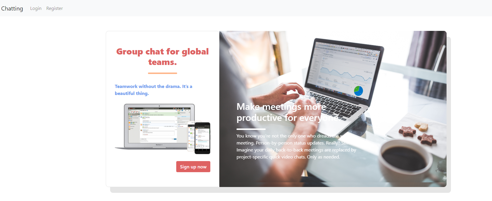
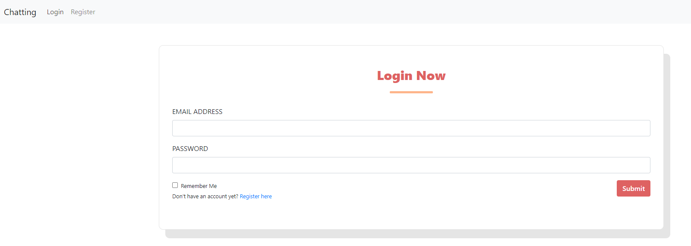
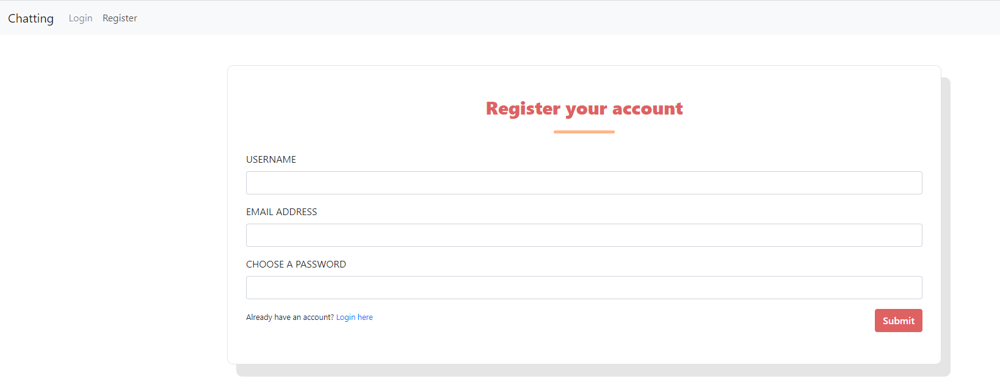
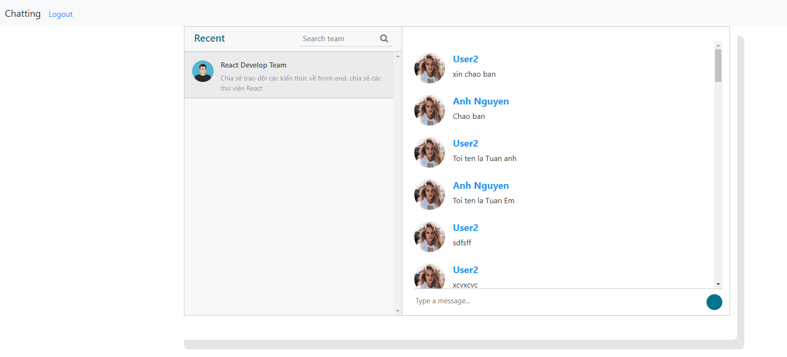

# React chat web demo
This is a basic chat application using React and Firebase.

This project was bootstrapped with [Create React App](https://github.com/facebook/create-react-app).

# [Screenshots](#screenshots)

|  Homepage    | Login  | Register | ChatRoom
| :-------: | :----: | :----: |  :----: |
|    |  |  | 

 

---------------

## Features
1. Login, Register, Logout implementation with firebase.
2. Team Realtime chat.
3. Archive chat history

## Dependencies
* "bootstrap": "^4.5.3",
* "firebase": "^7.24.0",
* "react": "^17.0.0",
* "react-bootstrap": "^1.3.0",
* "react-dom": "^17.0.0",
* "react-router": "^5.2.0",
* "react-router-dom": "^5.2.0",
* "react-scripts": "3.4.4",
* "react-spinners": "^0.9.0"

## Installation

* `git clone https://github.com/anhtbok92/react-chat.git`
* `cd react-chat`
* `npm íntall`
* `npm start`

Runs the app in the development mode. 
Open [http://localhost:3000](http://localhost:3000) to view it in the browser.

The page will reload if you make edits. 
You will also see any lint errors in the console.
